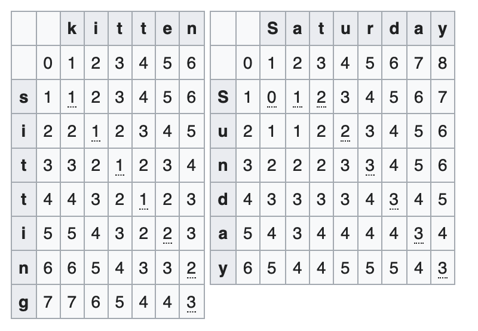

# Edit Distance
counting the minimum number of operations required to transform one string into the other

## Types of Edit distance
| Type | Allows |
| -------- | ------ |
| [Levenshtein Distance](#levenshtein-distance) | deletion, insertion, substitution |
| [Longest Common Subsequence (LCS)](#longest-common-subsequence-lcs) | deletion, insertion |
| Hamming Distance | substitution |
| Damerau–Levenshtein distance | insertion, deletion, substitution, transposition (adjacent)|
| Jaro Distance | transposition |

### Levenshtein Distance
Leetcode 72 [[link]](https://leetcode.com/problems/edit-distance/) [[code]](../Leetcode/72.py)

* Simplest Method: Wagner-Fischer Algorithm
    + Time O(mn), Space: O(mn)
    + Make an array size (m+1)\*(n+1)
        + Initialize row 0 & column 0 as index value
    + for loop i & j
        +  **arr[i][j] = min(arr[i-1][j], arr[i][j-1], arr[i-1][j-1]+substitution_cost)**
        + substitution_cost: 0 if same, 1 if difference

### Longest Common Subsequence (LCS)
Leetcode 1143 [[link]](https://leetcode.com/problems/longest-common-subsequence/) [[code]](../Leetcode/1143.py)

## References
[1] https://en.wikipedia.org/wiki/Edit_distance
[2] https://www.geeksforgeeks.org/longest-common-substring-dp-29/